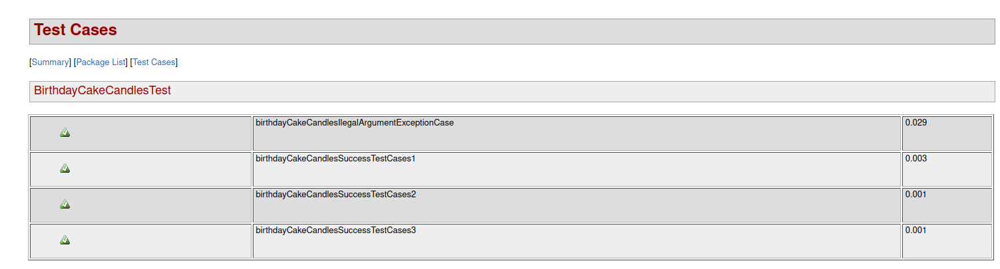

## Exercise 1

#### The project sources & tests are located into task1 folder


### Tests results:


### Run task 1
```bash
$ java -jar task1.jar 1 2 2 8 8 8 2
# 3

$ java -jar task1.jar 12 22 1 22 90 1 23 90 90 90 90 90
# 6

$ java -jar task1.jar 2 1 2 2 2 2 2 66
# 1
```


## Exercise 2
### Run
```bash
$ java -jar ./task2.jar -createUser -fn='Ion' -ln='Popov' -un='badboy01'
$ java -jar ./task2.jar -createUser -fn='Albert' -ln='Green' -un='green007'
$ java -jar ./task2.jar -createUser -fn='John' -ln='One' -un='one32'
$ java -jar ./task2.jar -addTask -tt='Homework' -td='Do homerowk...' -un='one32'
$ java -jar ./task2.jar -addTask -tt='Task1' -td='Do Something...' -un='one32'
$ java -jar ./task2.jar -addTask -tt='Test' -td='Test Do Something...' -un='green007'
$ java -jar ./task2.jar -addTask -tt='32Test' -td='32Test Do Something...' -un='badboy01'
$ java -jar ./task2.jar -addTask -showTasks -un='one32'
$ java -jar ./task2.jar -showTasks -un='one32'
# Task(title=Homework, description=Do homerowk..., ownerUserName=one32)
# Task(title=Task1, description=Do Something..., ownerUserName=one32)
# Task(title=null, description=null, ownerUserName=one32)
$ java -jar ./task2.jar -showTasks -un='badboy01'
# Task(title=32Test, description=32Test Do Something..., ownerUserName=badboy01)
$ java -jar ./task2.jar -showTasks -un='green007'
# Task(title=Test, description=Test Do Something..., ownerUserName=green007)
$ java -jar ./task2.jar -showAllUsers
# User(firstName=FirstName, lastName=LastName, userName=u1)
# User(firstName=FirstName, lastName=LastName, userName=u2)
# User(firstName=FirstName, lastName=LastName, userName=u3)
# User(firstName=Ion, lastName=Popov, userName=badboy01)
# User(firstName=Albert, lastName=Green, userName=green007)
# User(firstName=John, lastName=One, userName=one32)

```

